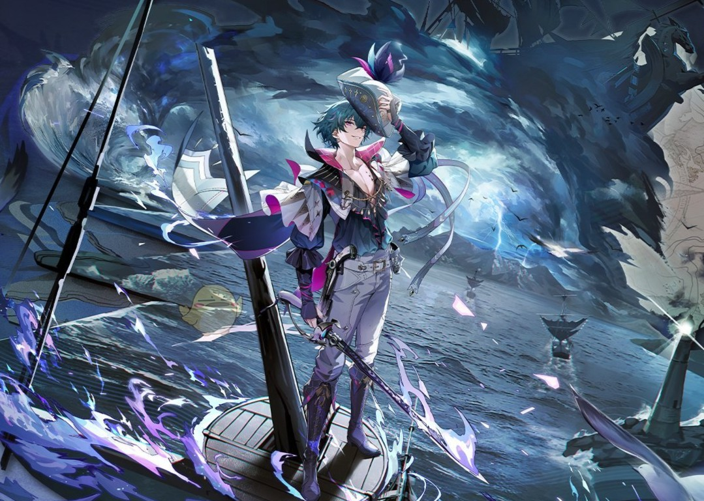

Special Vidao Take You Through the World of Mingchao:

# [不知不觉，寻寻觅觅已过千帆] (https://www.bilibili.com/video/BV1pahHzfE6x/?spm_id_from=333.1007.top_right_bar_window_custom_collection.content.click&vd_source=1da39dc25cf99f0b6d11289648c59e79)

You must be impressed by the conditions and customs there!


```{r}

```
<!DOCTYPE html>
<html>
<head>
  <meta charset="utf-8">
  <title>Introduction for the World in Mingchao</title>
  <style>
     body {
        margin: 0;
        padding: 0;
      }
    /* 鸣潮风格配色 - 科技感蓝色调 */
    .wuthering-waves {
        background: linear-gradient(135deg, #082c5bff, #04090fff);
        color: #f6f6f6;
        padding: 25px;
        border-radius: 0;
        margin: 0;
        font-family: 'Arial', sans-serif;
    }
    
    .ww-title {
        color: #4fd1c5; /* 青色 */
        text-shadow: 0 0 10px rgba(79, 209, 197, 0.3);
        border-bottom: 2px solid #4a5568;
        padding-bottom: 10px;
    }
    
    .ww-link {
        color: #f0be19ff; /* 浅蓝色 */
        text-decoration: none;
        display: block;
        padding: 8px 15px;
        margin: 5px 0;
        border-left: 3px solid transparent;
        transition: all 0.3s ease;
    }
    
    .ww-link:hover {
        color: #dbe618ff;
        border-left-color: #4299e1;
        background: rgba(66, 153, 225, 0.1);
        transform: translateX(5px);
    }
  </style>
</head>


<body>
  <div class="wuthering-waves">
    <br>
    <h1 class="ww-title">Walking in the wonderland; Experience the breath of freedom </h1>
    <p></p>
    <p></p>
    <h2 class="ww-title">Special Vidao Take You Through the World of Mingchao</h2>
    <p></p>
    <a href="https://www.bilibili.com/video/BV1pahHzfE6x/?spm_id_from=333.1007.top_right_bar_window_custom_collection.content.click&vd_source=1da39dc25cf99f0b6d11289648c59e79" target="_blank" rel="noopener" class="ww-link">Thousands of sailings have passed as we were immersed in exploring.</a>
    <p></p>
    <p>You must be impressed by the conditions and customs there!</p>
    <hr>
    
    
    
    
    <hr>
    <h2 class="ww-title">Introduction</h2>
    <p>Wuthering Waves is a next-generation, free-to-play open-world action RPG developed by Kuro Game. Set in a world revived after a catastrophic calamity, players embark on an epic journey as Rover, a custom-designed amnesiac protagonist awakening to a unfamiliar land.
    <p></p>
    The game is renowned for its fast-paced, stylish combat system. By harnessing a diverse cast of characters, each with unique abilities, players can perform spectacular combos, parry attacks, and master a "Echo" system. This innovative feature allows you to capture the essence of defeated enemies and transform into them, utilizing their powers to solve puzzles and dominate in battle.
Beyond combat, you are invited to explore the vast, beautifully rendered landscapes—from lush forests to desolate ruins—unraveling the mysteries of the world's past and present. With its stunning visuals, immersive soundtrack, and deep narrative, Wuthering Waves offers a thrilling adventure for action and exploration enthusiasts alike.</p>
    <h2>Main Character</h2>
    <a href="#Rover" class="ww-link">Rover</a><br>
    <a href="#Shorekeeper" class="ww-link">Shorekeeper</a><br>
    <a href="#Jinhxin" class="ww-link">Jinhxin</a><br>
    <p></p>
    <div id="Rover"></div>
    <div id="Shorekeeper"></div>
    <div id="Jinhxin"></div>
  </div>
</body>
</html>


```{r}

```


```{r}

```


